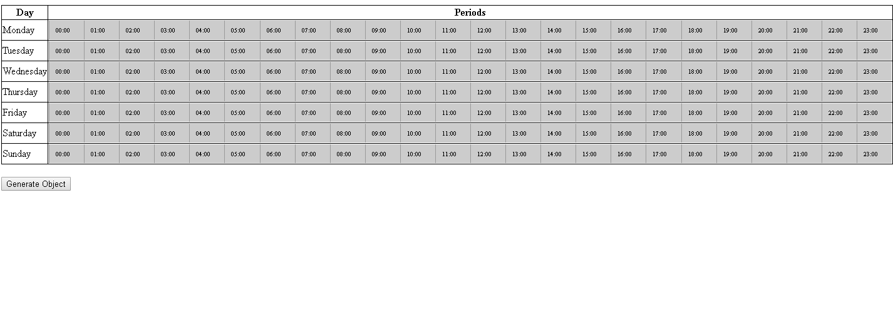

Week Multirange Elessar - Forked Repo.
===

Propose multirange like week calendar with Elessar

Elessar
=======


Demonstration
------------
[Demo](https://souzace.github.io/Elessar/demos/index.html)

Using
-----

Elessar exports as a CommonJS (Node) module, an AMD module, or a browser global:
```javascript
var period = [];
  for(var i=0; i < 7; i++){

    $('.rangebar_' + i).html(RangeBar({
      min: moment().startOf('day').format('LLLL'),
      max: moment().startOf('day').add(1, 'day').format('LLLL'),
      valueFormat: function(ts) {
        return moment(ts).format('HH:mm');
      },
      valueParse: function(date) {
        return moment(date).valueOf();
      },
      values: [],
      label: function(a){return a[0] + '-' + a[1]},
      snap: 1000 * 60 * 15,
      minSize: 1000 * 60 * 60,
      bgLabels: 24,
      allowDelete: true
    }).$el);
  }

  $(document).ready(function() {
    var week =
      {
        "monday" : [],
        "tuesday": [],
        "wednesday": [],
        "thursday": [],
        "friday": [],
        "saturday": [],
        "sunday": []
      }
    ;

    $("#generateObj").on("click", function(ev) {
      ev.stopPropagation();
      ev.preventDefault();

      var selectedPeriods = [];
      var days = Object.keys(week);
      for(var i =0; i < days.length; i++) {
        var weekDayName = days[i];

        var weekDayPeriods = $("#" + weekDayName + " .elessar-barlabel");

        for(var x =0; x < weekDayPeriods.length; x++ ){
          var period = (weekDayPeriods[x].innerText) ? weekDayPeriods[x].innerText : '';
          if (period.length > 0) week[weekDayName][x] = period;
        }
      }
      console.log(week);
      var jsonObjToApi = JSON.stringify(week);
      console.log(jsonObjToApi);
      var jsonObjToView = JSON.stringify(week, null, 2);
      $("#weekRangeObj").html(jsonObjToView);

    });
```
```html
<style>
  table {
    width: 100%;
  }
  table, th, td {
    border: 1px solid black;
    border-collapse: collapse;
  }

</style>
```
```html
<table>
  <thead>
    <tr>
      <th style="width: 4%">Day</th>
      <th>Periods</th>
    </tr>
  </thead>
  <tbody>
    <tr>
      <td>Monday</td>
      <td>
        <div id="monday" class="rangebar_0"></div>
      </td>
    </tr>
    <tr>
      <td>Tuesday</td>
      <td>
        <div id="tuesday" class="rangebar_1"></div>
      </td>
    </tr>
    <tr>
      <td>Wednesday</td>
      <td>
        <div id="wednesday" class="rangebar_2"></div>
      </td>
    </tr>
    <tr>
      <td>Thursday</td>
      <td>
        <div id="thursday" class="rangebar_3"></div>
      </td>
    </tr>
    <tr>
      <td>Friday</td>
      <td>
        <div id="friday" class="rangebar_4"></div>
      </td>
    </tr>
    <tr>
      <td>Saturday</td>
      <td>
        <div id="saturday" class="rangebar_5"></div>
      </td>
    </tr>
    <tr>
      <td>Sunday</td>
      <td>
        <div id="sunday" class="rangebar_6"></div>
      </td>
    </tr>
  </tbody>
</table>
<br />
<button id="generateObj">Generate Object</button>
<br />
<pre id="weekRangeObj"></pre>
```
Options
-------
```javascript
new RangeBar({
  values: [], // array of value pairs; each pair is the min and max of the range it creates
  readonly: false, // whether this bar is read-only
  min: 0, // value at start of bar
  max: 100, // value at end of bar
  valueFormat: function(a) {return a;}, // formats a value on the bar for output
  valueParse: function(a) {return a;}, // parses an output value for the bar
  snap: 0, // clamps range ends to multiples of this value (in bar units)
  minSize: 0, // smallest allowed range (in bar units)
  maxRanges: Infinity, // maximum number of ranges allowed on the bar
  bgMarks: {
    count: 0, // number of value labels to write in the background of the bar
    interval: Infinity, // provide instead of count to specify the space between labels
    label: id // string or function to write as the text of a label. functions are called with normalised values.
  },
  indicator: null, // pass a function(RangeBar, Indicator, Function?) Value to calculate where to put a current indicator, calling the function whenever you want the position to be recalculated
  allowDelete: true, // set to false to disable double main click to delete
  deleteTimeout: 5000, // maximum time in ms between main click
  vertical: false, // if true the rangebar is aligned vertically, and given the class elessar-vertical
  bounds: null, // a function that provides an upper or lower bound when a range is being dragged. call with the range that is being moved, should return an object with an upper or lower key
  htmlLabel: false, // if true, range labels are written as html
  allowSwap: true // swap ranges when dragging past
});
```

API
---
Some functions check original repor (https://github.com/quarterto-archive/Elessar)

Acknowledgment
---
* @quarterto - Bren Brightwell https://github.com/quarterto-archive
* @chlegou - Houcem Ben Amor Chlegou (https://codepen.io/chlegou/pen/mKZYKb)


Licence
-------
[MIT](licence.md)
