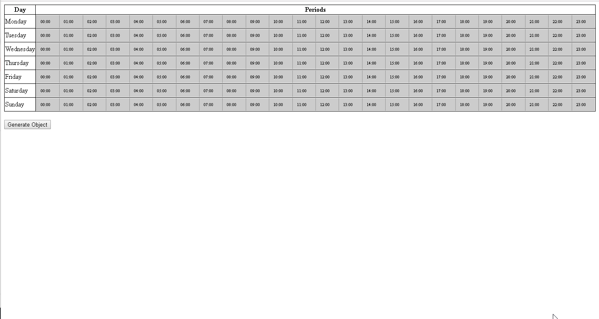

Week Multirange Elessar - Forked Repo.
===

Propose multirange like week calendar with Elessar

Elessar
=======


Draggable multiple range sliders


Installation
------------

Elessar requires [jQuery](http://jquery.com). If you're using npm or Bower, it's installed as part of this step. If not: a) why not? they're pretty sweet, b) download it, and I assume you're just using `<script>` tags, so just add a `<script>` tag.


Using
-----

Elessar exports as a CommonJS (Node) module, an AMD module, or a browser global:
```javascript
var RangeBar = require('elessar');
```
```javascript
require(['elessar'], function(RangeBar) { ... });
```
```html
<script src="path/to/elessar.js"></script>
```

Create a rangebar with `var rangeBar = new RangeBar` then add `rangeBar.$el` to the DOM somewhere.

Options
-------
```javascript
new RangeBar({
  values: [], // array of value pairs; each pair is the min and max of the range it creates
  readonly: false, // whether this bar is read-only
  min: 0, // value at start of bar
  max: 100, // value at end of bar
  valueFormat: function(a) {return a;}, // formats a value on the bar for output
  valueParse: function(a) {return a;}, // parses an output value for the bar
  snap: 0, // clamps range ends to multiples of this value (in bar units)
  minSize: 0, // smallest allowed range (in bar units)
  maxRanges: Infinity, // maximum number of ranges allowed on the bar
  bgMarks: {
    count: 0, // number of value labels to write in the background of the bar
    interval: Infinity, // provide instead of count to specify the space between labels
    label: id // string or function to write as the text of a label. functions are called with normalised values.
  },
  indicator: null, // pass a function(RangeBar, Indicator, Function?) Value to calculate where to put a current indicator, calling the function whenever you want the position to be recalculated
  allowDelete: true, // set to false to disable double main click to delete
  deleteTimeout: 5000, // maximum time in ms between main click
  vertical: false, // if true the rangebar is aligned vertically, and given the class elessar-vertical
  bounds: null, // a function that provides an upper or lower bound when a range is being dragged. call with the range that is being moved, should return an object with an upper or lower key
  htmlLabel: false, // if true, range labels are written as html
  allowSwap: true // swap ranges when dragging past
});
```

API
---
Some functions check original repor (https://github.com/quarterto-archive/Elessar)

Acknowledgment
---
* @quarterto - Bren Brightwell https://github.com/quarterto-archive
* @chlegou - Houcem Ben Amor Chlegou (https://codepen.io/chlegou/pen/mKZYKb)


Licence
-------
[MIT](licence.md)
